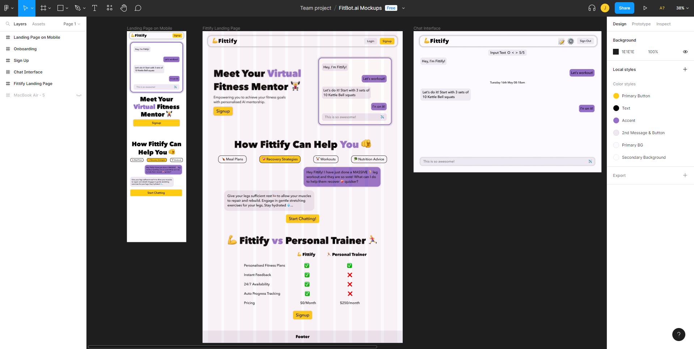
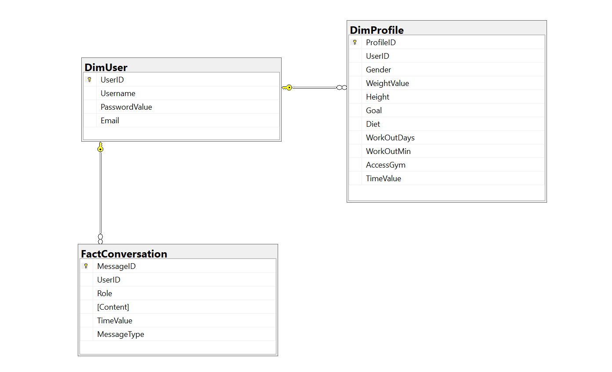

# 💪FITTIFY

## Introduction

Fittify is a web-based fitness application designed to provide personalised fitness advice through an interactive chatbot. Users can enter their personal information, which is used by the chatbot to generate customised workout and meal plans. The chatbot keeps track of past conversations, enabling continuity and a personalised experience.

<br>


<br>

## Table of Contents

-   [Special Features](#special-features)
-   [Page Navigation](#page-navigation)
-   [Design and Development](#design-and-development)
-   [Getting Started](#getting-started)
-   [Commit Logs](#commit-logs)
-   [Support](#support)
-   [Contributors](#contributors)

<br>

## Special Features

This web application includes special chat features ensuring a personalised experience for users. These special features include:

-   Personalised Chatbot: Provides customised workout and meal plans based on user's personal information.
-   Searchable Chat History: Allows users to search for specific words in their past conversations.
-   Responsive Design: The application is fully responsive and can be used on various devices.
-   Saved Plans: Users can save their workout and meal plans for easy reference and repetition.

<br>

## Page Navigation

Our application offers a user-friendly interface with easy navigation between different pages. Here is a brief overview of the various pages:

-   Sign Up Page
-   Log In Page
-   User Profile Page
-   Landing Page
-   Chatbot Page
-   Saved Messages Page

### Sign Up Page

The registration page provides users with the ability to set up an account, recording their email, username, and password in the database. Before being committed to the database, these credentials undergo a validation process, ensuring only allowed characters are utilised and that the email and username provided are unique.

### Log In Page

The login page validates the user's credentials by verifying if the provided information matches any existing records in the database. If the user's information does not already exist, the user is guided to the sign up page.

### User Profile Page

Once a first-time user successfully logs in, they are directed to the user profile page. This page asks for various details such as the user's gender, weight, height, fitness objectives, dietary habits, activity levels, and workout frequency per week. This collected information is utilised by the chatbot to tailor its fitness and meal plans, ensuring they are personalised based on the user's specific information.

Returning users are prompted on the chat page to revisit the profile page and update their details, including their physical measurements.

### Landing Page

The landing page serves as an introduction to the app's unique features and provides guidance on how to utilise them effectively. It showcases various functionalities of the chatbot, demonstrating how users can engage in interactive conversations. Additionally, buttons are available to navigate users to their dedicated chatbot page, providing a intuitive navigation between views.

### Chatbot Page

The chatbot page provides users with the opportunity to engage in conversations with the chatbot regarding their fitness needs, including meal and workout plans. To personalise the experience, the chatbot incorporates user profile information to tailor fitness and meal plans accordingly.

This page offers an in-chat search function, enabling users to easily search for specific words or refer back to past conversations. Upon accessing their chat page, users will find their entire chat history readily loaded.

When the chatbot sends messages to the user, they have the option to save these messages as, "fitness plans," "meal plans," or categorise them as "other" for important messages worth preserving. To access these saved messages conveniently, users can navigate to the Saved Messages Page.

### Saved Messages Page

The saved messages page displays a collection of saved messages and plans associated with the user's profile. At the top of the page, users will find buttons that enable them to easily filter and view specific categories such as, "fitness plans," "meal plans," or "other." This allows for a streamlined browsing experience, showing only the saved messages relevant to the selected option.

Additionally, each message on the saved messages page is accompanied by a delete button, providing users with the ability to remove any unwanted saved messages. While the message will be retained in the database, it will no longer be visible on the saved messages page, ensuring a clutter-free and personalised experience for the user.

<br>

## Design and Development

This web application was developed following best practices for web applications to ensure a robust and user-friendly experience. Here are some of the key aspects of the design and development process:

### Conceptualisation and Ideation

In recognising the ever-increasing need for accessible and personalised fitness guidance, our team was inspired to develop a solution that could rival the services of a personal trainer and be available at the click of a button. We identified that a chatbot, capable of delivering bespoke fitness advice in real-time, could fulfill this demand whilst also offering a cost-effective alternative to traditional personal training. Leveraging the power of modern technology, we sought to create an online platform that could instantaneously adapt to user's evolving fitness needs, providing accessible, convenient, and personalised guidance.

### Design Principles

Our web application embodies user-centric design principles, with intuitive interfaces, responsive design and consistent branding. To ensure responsivity and consistent user experience across different devices, we adopted a design-first approach using Figma. Figma allowed our team to create comprehensive design prototypes that accurately reflected the layout, visual elements, and interactive components of the web application. The Figma design process can be seen below.



### Technologies Used

Our team utilised a range of technologies to ensure a robust and effifient implementation. The core tools we used were:

-   Python - provides a versatile and powerful foundation for our back-end logic
-   Flask - to build our application's server-side components and handle routing and request handling
-   SQLite - a reliable and efficient relational database system
-   HTML, CSS and JavaScript - to create the user interface and enhance the client side functionality

### Architecture

Our web application employs a flexible and efficient architectural design to facilitate the complex interactions between users, the chatbot, and our database. The primary structure of our application follows the Model-View-Controller (MVC) architectural pattern. In our case, the "Model" represents our underlying data structure, where both user authentication information and personal fitness data are stored. The "View" embodies our user interfaces such as the login, personal information page, saved messages page and chat interface. Finally, the "Controller" encompasses the logic handling user inputs, data manipulation and communication between the Model and View.

The application integrates with the ChatGPT API, which forms an integral part of the Controller. When users interact with the chatbot on the View, their input, along with the stored personal fitness data, are sent as a prompt to the ChatGPT API. The response generated by the chatbot then gets displayed in the chat interface.

This architecture allows for a intuitive and personalised user experience, where the chatbot dynamically responds to fitness-related inquiries using user-specific data, making every interaction uniquely tailored to the user's fitness goals and preferences.

### Data Managememt

The application is underpinned by an SQLite3 database (fitBot.db) which manages the storage and retrieval of user and chat data. Three tables are defined in the schema: DimUser, DimProfile, and FactConversation. The DimUser table holds user account details such as username and password. DimProfile stores user profile information, including their fitness details and goals, with a foreign key linking each profile to a unique user. The FactConversation table keeps track of all user and bot conversations, each associated with a specific user, message ID and timestamp.

Data is handled via the SQLite3 Python library, with transactions like inserts and selects performed via raw SQL queries. User information, chat history, and chatbot responses are all stored and retrieved from the database using these queries, providing a persistent storage solution for user data and conversation history.

As part of the data validation process, SQLite3's data typing enforcement ensures that only data of the correct type is stored in the database, while Flask's request handler is used to verify the presence and format of incoming data. Additionally, data is sanitised via the SQLite3 Python library's built-in query parameterisation, reducing the risk of SQL injection attacks.

Environment variables, including the path to the SQLite3 database, are managed through a .env file, maintaining a clear separation between configuration and code.



### Testing and Quality Assurance

Our web application prioritises testing and quality assurance to ensure a reliable and robust user experience. We have implemented a comprehensive suite of tests using the pytest framework to cover various aspects of our application. These tests include functionality tests for features like chat, login, logout, search and message saving. The testing files are supported by a testing database (test_db.db), which ensures that testing doesn't interfere with the primary database (fitBot.db). We also perform unit tests to validate individual components and integration tests to ensure proper interaction between different modules. To run the tests for our web application, navigate to project directory (CITS3403) and execute the Python test files. This can be done by running the command below in the terminal or command prompt.

```bash
 python -m pytest tests/
```

Tests focused around front-end development and user-experience were also run using Selenium and can be executed through the steps below.

To run the Selenium tests:

1. Ensure you have the Selenium IDE installed on your machine.

2. Open the Selenium IDE and import the test suite or individual test cases.

3. Configure the necessary settings such as browser selection, test environment, etc.

4. Start the test execution in the Selenium IDE.

### Security Considerations

Our web application incorporates several security measures to protect user data and ensure secure user interactions. Firstly, user authentication is implemented using secure password hashing with the Werkzeug library to safeguard user credentials. Passwords are never stored in plain text in the database. Additionally, input validation is employed to prevent common vulnerabilities such as SQL injection and cross-site scripting. The use of regular expressions to validate email addresses adds an extra layer of security. Furthermore, the web application utilises session management to handle user sessions securely, ensuring the confidentiality and integrity of user data.

### Scalability and Deployment

During testing, our application successfully demonstrated its ability to support concurrent usage by multiple users. This means that multiple users can simultaneously interact with the product without experiencing any significant performance issues or conflicts. Whilst it can support a small number of users, in order to scale efficiently we require two things: (1) a higher API request limit which may include utilising multiple API keys or contacting openai to allow for larger request rates, and (2) a more scalable database solution (such as mongo.db).

<br>

## Getting Started

### Installation

1. Clone the repository:

```bash
git clone https://github.com/juliaceliberti/CITS3403.git
```

2. Navigate to the project directory:

```bash
cd CITS3403
```

3. Install the required packages:

```bash
pip install -r requirements.txt
```

4. Create a .env file in the project directory and place the following line inside of it:

```bash
DATABASE_URL=app/fitBot.db
```

### Running the Project

1. Start the Application:

```bash
python run.py
```

<br>

## Attributions

-   Please view the requirements.txt file for a detailed listing of all external libraries utilised
-   The wireframing process was performed in figma (https://www.figma.com/)
-   All icons utilised within this app originate from FontAwesome (https://fontawesome.com/)
-   All emjois utilised are unicode
-   The fonts utilised within this project originated from Free Fonts Family (https://freefontsfamily.com/avenir-next-font-download-free/)
-   The ERD was generated in Sql Server Manager Studio (https://learn.microsoft.com/en-us/sql/ssms/download-sql-server-management-studio-ssms?view=sql-server-ver16)

<br>

## Support

For any queries or support, please reach out to us on the following emails:

-   22782161@student.uwa.edu.au
-   22891889@student.uwa.edu.au
-   23067296@student.uwa.edu.au

## Contributors

-   Tyler Illman
-   Julia Celiberti
-   Jazmyn Uden
